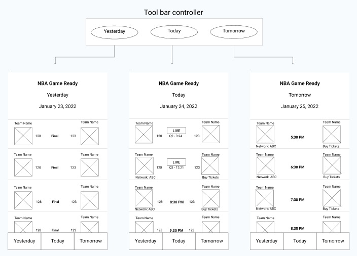
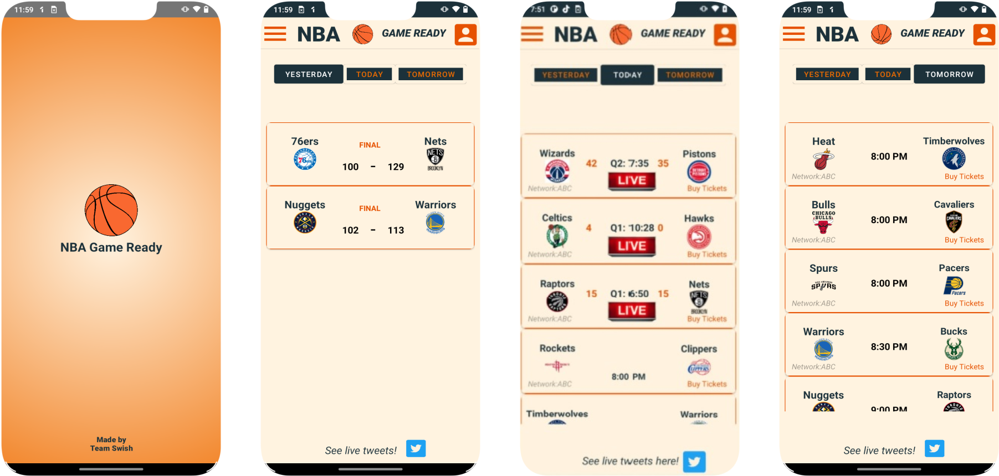
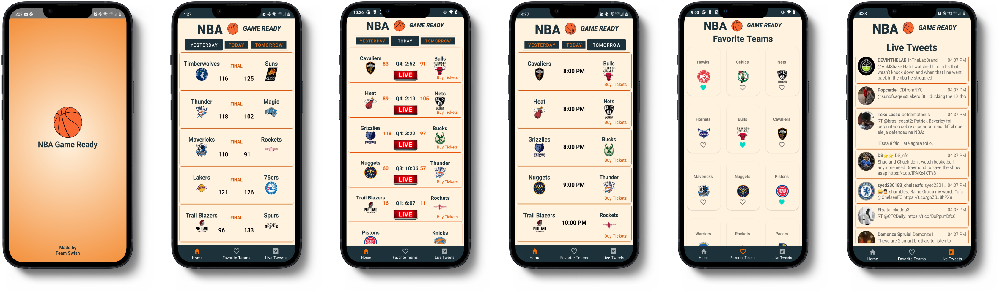
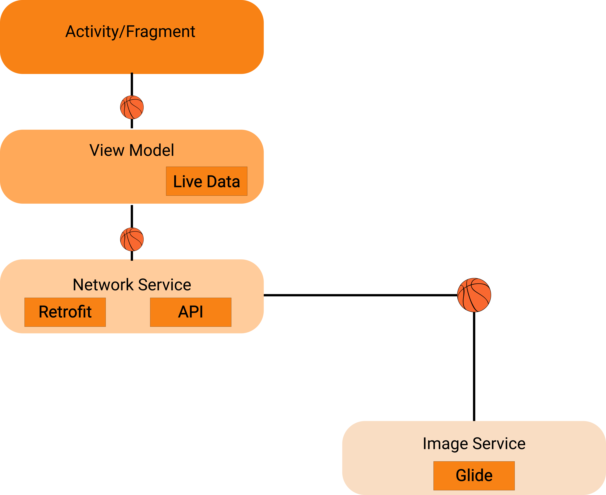

# 🏀 NBA Game Ready 🏀

## Table of Contents
1. [Overview](#Overview)
2. [Product Spec](#Product-Spec)
3. [Wireframes](#Wireframes)
4. [Prototypes](#Prototypes)
5. [Networking](#Networking)
6. [Architecture](#Architecture)
7. [Responsibilities](#Responsibilities)
8. [Video Walkthrough](#Video-Walkthrough)
9. [Website](#Website)

## Overview
### Description

NBA Game Ready is an app that displays all live, upcoming, and the previous day's NBA games, in a format that's quick and easy to read. Users can also keep up with the games that are playing through the live tweets in app. We used API NBA to create this app.

### App Evaluation

- **Category:** Sports
- **Mobile:** This app is primarily developed for mobile. Functionality wouldn't be limited to mobile devices, however mobile version could potentially have more features.
- **Story:** Allows users to answer the question "Who's playing tonight?"
- **Market:** Ages 4+
- **Habit:** This app could be used as often as needed during the NBA season.
- **Scope:** First, we are displaying live game updates.  Eventually the app could evolve to displaying team and player stats from a user search along with television networks of games airing.

## Product Spec

### 1. User Stories (Required and Optional)

**Required Must-have Stories**
- [X] User launches app to see a list of all NBA games for the current day
- [X] User sees live updates on scores for each game
- [X] User can click on a game and go to website to purchase tickets
- [X] User can add team to their favorites list
- [X] User can see most recent tweets about current live games

**Optional Nice-to-have Stories**
- [ ] User clicks on a game listed and can see team and player stats
- [ ] User can see if they are close to a stadium in map view
- [ ] User wants to know which games are televised and what channels those games are on
- [ ] User clicks on the network of the televised games and is taken to the network website
- [ ] User can set reminders and notifications for games
- [X] User can get notified any time their favorite teams are playing
- [ ] User has an option to create an account and profile to have quick access to favorites, saved games, and setup notifications
- [ ] User has accessibility options
- [ ] User can change text to multiple different languages

### 2. Screen Archetypes

* Live Games Screen
   * lists of game times, scores, quarters, and television networks
   * buy ticket icon/button that connects to ticketing website
   
* Yesterday Games Screen
   * lists of games and final scores 
   
* Tomorrow Games Screen
   * lists of game times and television networks
   * buy ticket icon/button that connects to ticketing website
   
* Tweets Screen
   * live tweets of current games being played 

* Favorite Teams Screen
   * lists of teams where user can check their favorite teams
   
  

### 3. Navigation

**Flow Navigation** (Screen to Screen to Browser)

* Today screen -> <- Yesterday screen -> <- Tomorrow screen -> <- Favorite Teams -> <- Tweets
* Buy ticket button -> Opens browser to ticketing website

## Wireframes

### First Prototype

### Final Prototype

## Networking

##### API-NBA
- Base URL - [https://api-nba-v1.p.rapidapi.com/](https://api-nba-v1.p.rapidapi.com/)

   HTTP Verb | Endpoint | Description
   ----------|----------|------------
    `GET`    | /games/live/ | get all available games in play
    `GET`    | /games/date/ | get all games by a specific date
    
    
## Architecture
MVVM Architecture: Model-View-ViewModel

## Responsibilities

| Name | Packages |
| - | :-: |
| `Kieran` | Backend | 
| `Raven`  | Backend       |
| `Yunis`  | Backend |
| `Claire` | Frontend |
| `Shikeya` | Frontend |
| `Sabur` | Backend |

## Video Walkthrough

## Website
 https://nba-game-ready.github.io/nba-game-ready

